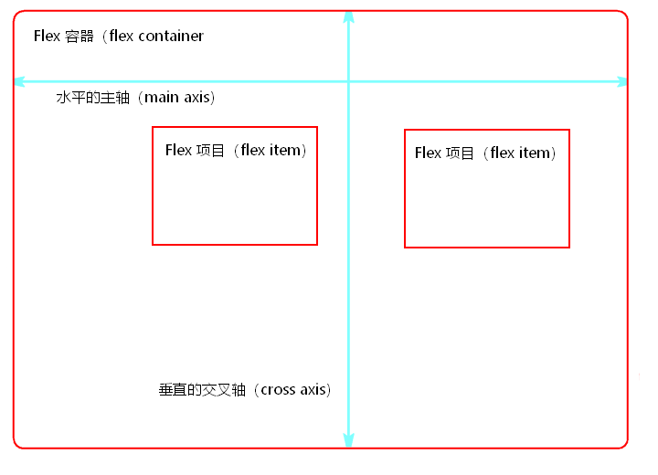

<!--
 * @Author: hft
 * @Date: 2021-09-23 15:10:09
 * @LastEditors: hft
 * @LastEditTime: 2021-09-23 16:23:38
 * @Description: file content
-->
## 一.基础
### 1.基本用法
**任何一个容器都可以指定为 Flex 布局**
```javascript
.box{
  display: flex;
}
```
**行内元素也可以使用 Flex 布局。**
```javascript
.box{
  display: inline-flex;
}
```
**注意，设为 Flex 布局以后，子元素的float、clear和vertical-align属性将失效。** 

### 2.基本概念
采用 Flex 布局的元素，称为 Flex 容器（flex container），简称`"容器"`。它的所有子元素自动成为容器成员，称为 Flex 项目（flex item），简称`"项目"`。

容器默认存在两根轴：`水平的主轴（main axis）`和`垂直的交叉轴（cross axis）`。主轴的开始位置（与边框的交叉点）叫做`main start`，结束位置叫做`main end`；交叉轴的开始位置叫做`cross start`，结束位置叫做`cross end`。

项目默认沿主轴排列。单个项目占据的主轴空间叫做`main size`，占据的交叉轴空间叫做`cross size`。



## 二、容器的属性
以下6个属性设置在容器上。
* flex-direction
* flex-wrap
* flex-flow
* justify-content
* align-items
* align-content

### 2.1flex-direction属性
1. 定义：决定主轴的方向（即项目的排列方向）
2. 属性值
* `row（默认值）`：主轴为水平方向，起点在左端。
* `row-reverse`：主轴为水平方向，起点在右端。
* `column`：主轴为垂直方向，起点在上沿。
* `column-reverse`：主轴为垂直方向，起点在下沿。
3. 用法
```css
.box {
  flex-direction: row | row-reverse | column | column-reverse;
}
```

### 2.2flex-wrap属性
1. 定义：默认情况下，项目都排在一条线（又称"轴线"）上。flex-wrap属性定义，如果一条轴线排不下，如何换行。
2. 属性值
* `nowrap（默认）`：不换行。
* `wrap`：换行，第一行在上方。
* `wrap-reverse`：换行，第一行在下方。
3. 用法
```css
.box{
  flex-wrap: nowrap | wrap | wrap-reverse;
}
```

### 2.3 flex-flow
1. 定义：`flex-flow`属性是`flex-direction`属性和`flex-wrap`属性的简写形式，默认值为`row nowrap`。
2. 用法
```css
.box {
  flex-flow: <flex-direction> || <flex-wrap>;
}
```

### 2.4 justify-content属性
1. 定义：justify-content属性定义了项目在主轴上的对齐方式。
2. 属性值:
* `flex-start（默认值）`：左对齐
* `flex-end`：右对齐
* `center`： 居中
* `space-between`：两端对齐，项目之间的间隔都相等。
* `space-around`：每个项目两侧的间隔相等。所以，项目之间的间隔比项目与边框的间隔大一倍。
3. 用法
```css
.box {
  justify-content: flex-start | flex-end | center | space-between | space-around;
}
```

### 2.5 align-items属性
1. 定义：align-items属性定义项目在交叉轴上如何对齐。
2. 属性值
* flex-start：交叉轴的起点对齐。
* flex-end：交叉轴的终点对齐。
* center：交叉轴的中点对齐。
* baseline: 项目的第一行文字的基线对齐。
* stretch（默认值）：如果项目未设置高度或设为auto，将占满整个容器的高度。
3. 用法
```css
.box {
  align-items: flex-start | flex-end | center | baseline | stretch;
}
```

## 三、项目的属性
以下6个属性设置在项目上。
* order
* flex-grow
* flex-shrink
* flex-basis
* flex
* align-self

### 3.1 order属性
1. 定义：order属性定义项目的排列顺序。数值越小，排列越靠前，默认为0。
2. 用法
```css
.item {
  order: <integer>;
}
```

### 3.2 flex-grow属性
1. 定义：flex-grow属性定义项目的放大比例，默认为0，即如果存在剩余空间，也不放大。
2. 用法
```css
.item {
  flex-grow: <number>; /* default 0 */
}
```

如果所有项目的flex-grow属性都为1，则它们将等分剩余空间（如果有的话）。如果一个项目的flex-grow属性为2，其他项目都为1，则前者占据的剩余空间将比其他项多一倍。

### 3.3 flex-shrink属性
1. 定义：flex-shrink属性定义了项目的缩小比例，默认为1，即如果空间不足，该项目将缩小。
2. 用法
```css
.item {
  flex-shrink: <number>; /* default 1 */
}
```

如果所有项目的flex-shrink属性都为1，当空间不足时，都将等比例缩小。如果一个项目的flex-shrink属性为0，其他项目都为1，则空间不足时，前者不缩小。

负值对该属性无效。

### 3.4 flex-basis属性
1. 定义：flex-basis属性定义了在分配多余空间之前，项目占据的主轴空间（main size）。浏览器根据这个属性，计算主轴是否有多余空间。它的默认值为auto，即项目的本来大小。
2. 用法
```css
.item {
  flex-basis: <length> | auto; /* default auto */
}
```
它可以设为跟width或height属性一样的值（比如350px），则项目将占据固定空间。

### 3.5 flex属性
1. 定义：flex属性是flex-grow, flex-shrink 和 flex-basis的简写，默认值为0 1 auto。后两个属性可选。
2. 属性值
该属性有两个快捷值：auto (1 1 auto) 和 none (0 0 auto)。

建议优先使用这个属性，而不是单独写三个分离的属性，因为浏览器会推算相关值。   
3. 用法
```css
.item {
  flex: none | [ <'flex-grow'> <'flex-shrink'>? || <'flex-basis'> ]
}
```
### 3.6 align-self属性
1. 定义：align-self属性允许单个项目有与其他项目不一样的对齐方式，可覆盖align-items属性。默认值为auto，表示继承父元素的align-items属性，如果没有父元素，则等同于stretch。
2. 属性值
属性可能取6个值，除了auto，其他都与align-items属性完全一致。  
3. 用法
```css
.item {
  align-self: auto | flex-start | flex-end | center | baseline | stretch;
}
```
## 参考
http://www.ruanyifeng.com/blog/2015/07/flex-grammar.html