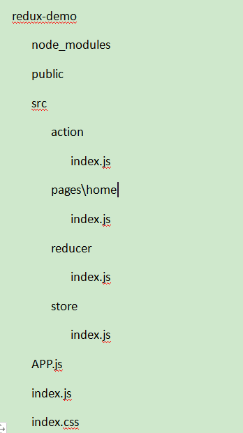
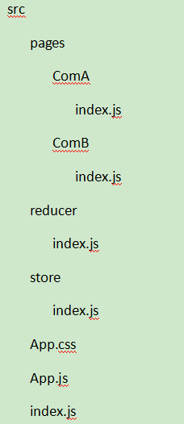
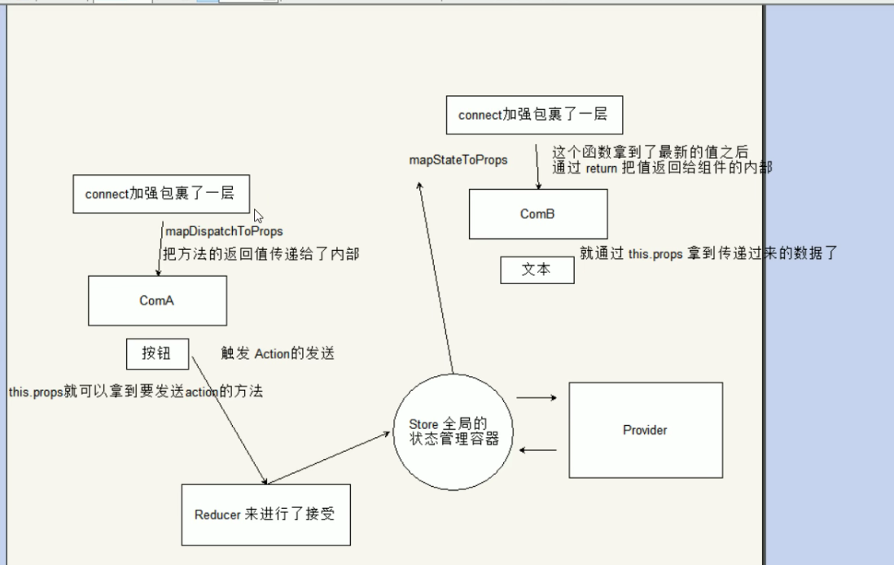

<!--
 * @Author: your name
 * @Date: 2021-08-30 15:22:20
 * @LastEditTime: 2021-09-09 12:11:32
 * @LastEditors: Please set LastEditors
 * @Description: In User Settings Edit
 * @FilePath: \myblog_local\docs\react\0.1React-redux.md
-->
## 一.redux

主要目录结构如下：



1. 构建`Action`
    * 在根目录下创建一个文件夹action
    * 在该目录下创建一个`index.js`文件，用来构建`action`
    * 在`action`创建函数里面利用`return`，返回一个`action`对象，注意需要携带`type`属性
    * 把这个`action`创建函数进行导出
  
`action/index.js`
```javascript
const sendAction=()=>{
    return {
        type:'send type',
        value:'我是一个action'
    }
}
module.exports={sendAction}
```

2. 构建`Reducer`
   * 在根目录下创建一个文件夹`reducer`
   * 在该目录下创建一个`index.js`文件,用来构建`reducer`,注意`reducer`要接收两个参数
   * 第一个参数是`state`,可以定义一个初始化`state`，然后进行赋值
   * 在函数里面判断第二个参数`action`的`type`值是否是我们发送的
   * 如果是，可以通过`return`返回一个新的`state`
   * 把`return`导出

`reducer/index.js`
```javascript
const initState={value:'默认值'}
const reducer=(state=initState,action)=>{
    switch(action.type){
        case 'send type':
            return Object.assign({},state.action)
        default:
            return state    
    }
}
module.exports={sendAction}
```

3. 构建`store`
   * 在根目录下创建一个文件夹`store`
   * 在该目录下创建一个`index.js`文件，用来构建`store`,注意`createState`函数里面第一个参数里面接收的是`reducer`
   * 导出刚刚创建的`reducer`,然后设置到函数里面
   * createStore的返回值就是创建好的`store`,然后进行导出
  
`store/index.js`  将`action`与`reducer`关联
```javascript
import {createStore} from '../reducer'
import {reducer} from '../reducer'
const store=createStore(reducer)
export default store
```

4. 使用
   * 给页面的`button`按钮绑定一个点击事件
   * 在组件加载完事后通过`store`来进行监听的注册，返回值可以用来注销监听
   * 在点击事件函数中，通过`store`,`dispatch`来发送一个`action`
`home/index.js` 
```javascript
import React from 'react'
import Store from '../../Store'
import {sendAction} from '../../action'
export default class Home extends React.Components{
    handleClick=()=>{
        const action=sendAction()
        store.dispatch(action)
    }
    componentDidMoount(){
        store.subscrible(()=>{
            console.log("subscrible",store.getState())
            this.setState({})//以为不需要set什么数据，写{}，实质上是调用render
        })
    }
    render(){
        return (
            <>
            <button onClick={this.handleClick}>点我发送一个action</button>
            <div>{store.getState().value}</div>
            </>
        )
    }
}
```
## 二.React-redux
主要目录结构



1. 安装相关依赖
    ```javascript
    yarn add redux
    yarn add react-redux
    ```
2. 构建`store`和`reducer`
   * 创建`reducer/index.js`文件，构建`reducer`来响应`actions`
   * 创建`store/index.js`文件，通过`createStore`方法，把`reducer`传进来
   * 在`app.js`中引入`store`
 `reducer/index.js`
 ```javascript
 const initState={count:0}
 exports.reducer=(state=initState,action)=>{//判断发送过来的action是不是需要的，如果是，返回新的state
     console.log("reducer",action)
     switch(action.type){
         case 'add_action'://④判断
            return {
                count:state.count+1
            }
        default: return state    //⑤返回值
     }
 }
 ``` 
 `store/index.js`
 ```javascript
import {createStore} from '../reducer'
import {reducer} from '../reducer'
const store=createStore(reducer)
export default createStore(reducer)
 ``` 
3. 构建页面结构
   * 创建一个组件，叫`ComA`，里面放`button`按钮
   * 创建另外一个组件，叫`ComB`,里面放`div`
   * 在`app.js`中引入两个组件
4. `Provider`组件实现
   * 导入`Provider`组件
   * 需要利用`Provider`组件对整个结构进行包裹
   * 给P`rovider`组件设置`state`属性，而这个值就是通过`createStore`构建出来的`store`实例对象
  
`App.js`
 ```javascript
import React from 'react'
import './App.css'
import store from './store'
import {Provider} from 'react-redux'
import ComA from './pages/ComA'
import ComB from './pages/ComB'
function App(){
    return (
        <Provider store={store}>
            <div className="App">
                <ComA>
                <ComB>
            </div>
        </Provider>
    )
}
export default App
 ```   
1. `ComA`发送`action`
   * 导入`connect`
   * 利用`connect`对组件进行加强，
     `connect(要接受数组的函数，要发送action的函数)(放入要加强的组件)`
   * 需要实现`connect`的第二个参数
   * 构建一个函数`mapDispatchToProps(dispatch)`
   * 在这个函数里就可以返回一个对象
    `key` 方法名
    `value` 调用`dispatch`发送`action`
   * 在组件的内容可通过`this.pros`来拿到这个方法
 
 `ComA/index.js`
 ```javascript
import {React} from 'react'
import {connect} from 'react-redux'
class ComA extends React.Component{
    handleClick()=>{
        console.log("comA",this.props)
        this.props.sendAction()//②发送action ③action到reducer里去
    }
    render(){
        return <button onClick={this.handleClick}>+</button> //①点击
    }
}
const mapDispatchToProps=dispatch=>{ //这个函数要有一个返回值，返回值是一个对象
    return {
        sendAction:()=>{//利用dispatch发送一个action
            dispatch({//利用action对象，定义一个type属性
                type:"add_action"
            })
        }
    }
}
export default connect(null,mapDispatchToProps)(ComA) //A发送发，实现第二个参数
 ```  
6. `ComB`接受`state` 
   * 导入`connect`方法
   * 利用`connect`对组件进行加强
   * `ComB`属于接收方，需实现`connect`的第一个参数
   * `mapStateToPrps`里面的第一个参数就是`state`
   * 把`state`进行`return`才能在组件的内部回去到最新的数据
   * `ComB`是否能拿到数据，关键点是`reducer`
   * 只有`reducer`里面返回新的`state`时，才能获取到

`ComB/index.js`
 ```javascript
import {React} from 'react'
import {connect} from 'react-redux'
class ComB extends React.Component{
    render(){
        console.log("ComB",this.props)
        return <div>{this.props.count}</div>//⑦返回值，通过this.props拿到
    }
}
const mapStateToProps=state=>{
     console.log("ComB",state)
     return state //⑥进入B组件，返回值
}
export default connect(mapStateToProps)(ComA) //B是接收方，需实现第一个参数
 ```  
7. 数据传递流程
   


补充
* `connect` 组件被`connect`加强，才能使用store里的数据
  第一个参数：那个组件需要接收参数，就写这个参数，接收方，`ComB`
  第二个参数：发送方`ComA`
* react触发更新：外界的`props`发生变化，`this.setState`,`propsUpdate`  

## 【参考】
 https://www.bilibili.com/video/BV1oE411V7RW?p=1