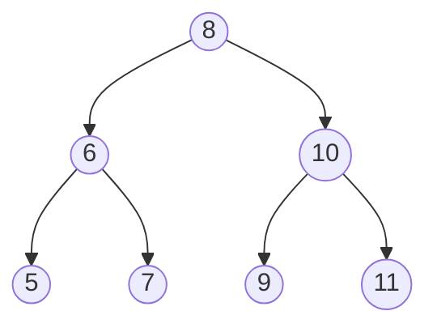
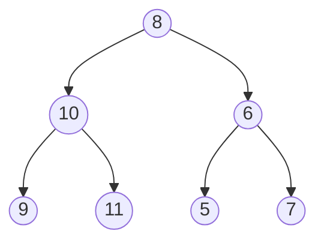

# 二叉树的镜像


## 题目描述

操作给定的二叉树，将其变换为源二叉树的镜像。

源二叉树


镜像二叉树




## 思路

先交换根节点的两个子结点之后，我们注意到值为10、6的结点的子结点仍然保持不变，因此我们还需要交换这两个结点的左右子结点。做完这两次交换之后，我们已经遍历完所有的非叶结点。此时变换之后的树刚好就是原始树的镜像。交换示意图如下所示：


## 代码 
```javascript
/*
 * function TreeNode(x) {
 *   this.val = x;
 *   this.left = null;
 *   this.right = null;
 * }
 */
/**
 * 代码中的类名、方法名、参数名已经指定，请勿修改，直接返回方法规定的值即可
 *
 * 
 * @param pRoot TreeNode类 
 * @return TreeNode类
 */
function Mirror( pRoot ) {
    // write code here
    if (!pRoot) {
        return null;
    }
    // 交换当前节点的左右节点
    const leftCopy = pRoot.left;
    pRoot.left = pRoot.right;
    pRoot.right = leftCopy;

    // 对左右子树做相同操作
    Mirror(pRoot.left);
    Mirror(pRoot.right);

    return pRoot;

}
module.exports = {
    Mirror : Mirror
};
```
