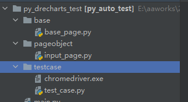

<!--
 * @Author: hft
 * @Date: 2021-08-28 15:38:45
 * @LastEditTime: 2021-09-09 17:14:01
 * @LastEditors: Please set LastEditors
 * @Description: In User Settings Edit
 * @FilePath: \myblog_local\docs\selenium\0.1简介.md
-->

资料整理这里的：https://www.bilibili.com/video/BV1Ey4y1L7xU?p=3
将代码也一并整理好
## 一.WEB自动化介绍
1. 所有项目都可以做自动化
   * 软件需求变更不频繁
   * 项目周期比较长
   * 自动化脚本能够重复利用
2. 自动化测试介入点：系统测试
3. 自动化项目实施过程：可行性分析，框架的选择（selenium，RF）,需求分析，计划，测试用例设计，无人值守，提交报告，脚本维护
## 二.Python+Selenium环境搭建
* 安装Python
* 安装Pythoncharm
* selenium
* chrome浏览器驱动
## 三.八大元素定位
1. 前提：需要定位的元素属性必须唯一
2. 八大元素：id,name,class_name,css,tag_name,link_text,part_link_text
3. 示例  
```python
from selenium import webdriver
from selenium.webdriver.common.by import By

driver = webdriver.Chrome()
driver.get("https://www.baidu.com")
# id定位
driver.find_element(By.ID,'kw').send_keys("123")
# name定位
driver.find_element(By.NAME,'wd').send_keys("123")
# link_text定位
driver.find_element(By.LINK_TEXT,'地图').click()
# PARTIAL_LINK_TEXT定位
driver.find_element(By.PARTIAL_LINK_TEXT,'新').click()
# xpath定位 相对路径+索引定位
driver.find_element(By.XPATH,'//form/span[1]/input').send_keys("123")
# 相对路径+属性定位 属性autocomplete 属性值为off
driver.find_element(By.XPATH,'//input[@autocomplete="off"]').send_keys("123")
# 相对路径+通配符定位
driver.find_element(By.XPATH,'//input[@*="off"]').send_keys("123")
# 相对路径+部分属性值定位 定位autocomplete属性，属性值是of开头的
# 开头
driver.find_element(By.XPATH,'//*[starts-with(@autocomplete,"of")]').send_keys("123")
# 结尾
driver.find_element(By.XPATH, '//*[substring(@autocomplete,2)="ff"]').send_keys("123")
# 包含
driver.find_element(By.XPATH,'//*[contains(@autocomplete,"of")]').send_keys("123")
# 相对路径+文本定位
value=driver.find_element(By.XPATH,"//span[text()='按图片搜索']").get_attribute('class')
print(value)
```    
4. css定位
   * 绝对路径：不用
   * 通过id和class定位
   * 通过属性定位
   * 通过部分属性定位
   * 查询子元素定位
   * 查询兄弟节点定位
## 设计模式（封装）
##### 分三层：
 1. 基础层：base主要放selenium原生方法
 2. 页面对象层：po(po模式即页面对象模式)主要用于放页面的元素和页面的动作
 3. 测试用例层：testcase存放测试用例以及测试数据
##### 示例
1. 主要目录结构

2. 例子代码
`base/base_page.py`
```python
from selenium import webdriver

class BasePage:
    def __init__(self):
        global driver
        # 打开浏览器
        self.driver = webdriver.Chrome()
        driver=self.driver
        # 加载网页
        self.driver.get("http://localhost:8001/")
    #     定位元素
    def locator_element(self,loc):
        return self.driver.find_element(*loc)
```   
`pageobject/input_page.py`
```python
import json

from selenium.webdriver.common.by import By

from base.base_page import BasePage

class InputPage(BasePage):

    input_loc=(By.XPATH, "//input[@placeholder='请输入请求的地址']")
    text_input_loc=(By.XPATH, "//textarea[@placeholder='请输入对应的参数']")
    post_loc=(By.XPATH,"//button[@id='post_request']")


    def input_url(self):
        text_input_value = {
            "curd": "query",
            "table": "gsk_motorline_day",
            "func": "find",
            "format": "compact",
            "where":值
        }
        t1 = str(text_input_value)
        print(json.JSONEncoder().encode(t1))
        self.locator_element(InputPage.input_loc).send_keys(要输入的url)
        self.locator_element(InputPage.text_input_loc).send_keys(json.JSONEncoder().encode(t1))
        self.locator_element(InputPage.post_loc).click()
```   
`testcase/test_case.py`
```python
import unittest
from pageobject.input_page import InputPage
class TestCase():

    def test_01_input():
        inpt=InputPage()
        inpt.input_url()

if __name__ == '__main__':
    TestCase.test_01_input()
```   