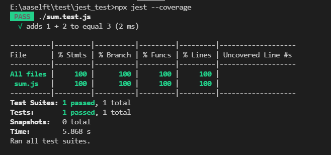

<!--
 * @Author: your name
 * @Date: 2021-08-30 14:07:19
 * @LastEditTime: 2021-08-30 15:16:44
 * @LastEditors: Please set LastEditors
 * @Description: In User Settings Edit
 * @FilePath: \myblog_local\docs\web_auto\0.2jest.md
-->
## 一.安装
1. 安装node
2.  生成package.json文件 ` npm init`
3. 安装Jest框架
```javascript
yarn add --dev jest
```

## 二.基本使用
1. 创建`sum.js` 文件
```javascript
function sum(a, b) {
  return a + b;
}
module.exports = sum;
```
2. 创建名为 `sum.test.js` 的文件
```javascript
const sum = require('./sum');

test('adds 1 + 2 to equal 3', () => {
  expect(sum(1, 2)).toBe(3);
});
```
3. 将如下代码添加到 `package.json` 中：
```javascript
{
  "scripts": {
    "test": "jest"
  }
}
```
4. 执行命令`yarn test` 或者`npm run test`,执行结果如下：


<!--  -->


## 三.生成测试覆盖率
1. Jest初始化配置
```javascript
npx jest --init
```  
之后会有一些选项，你根据自己的需要进行选择就可以了：
* Choose the test environment that will be used for testing ? 代码是运行在Node环境还是Web环境下？
* Do you want Jest to add coverage reports ? 是否生成测试覆盖率文件？
* Automatically clear mock calls and instrances between every test?是否需要在测试之后清楚模拟调用的一些东西？
* 在这三个选项选择之后，你会发现你的工程根目录下多了一个jest.config.js的文件。打开文件你可以看到里边有很多Jest的配置项。
2.  `coverageDirectroy`详解
`coverageDirectroy`的配置是用来打开代码覆盖率的，如果我们把代码写成下面的样子,就说明打开了代码覆盖率的这个选项。
```javascript
coverageDirectory : "coverage"   //打开测试覆盖率选项
``` 
当这个选项被打开后，我们就可以使用下面的命令,jest就会自动给我们生成一个代码测试覆盖率的说明。
3. 生成覆盖率说明
```javascript
 npx jest --coverage 
```   
当然这个不仅会有一个简单的终端图表，还会生成一个coverage的文件夹，这里边有很多文件。


我们可以打开coverage-lcov-reporrt-index.html文件，这时候就可以看到一个网页形式的，非常漂亮的测试覆盖率报告。
c

补充解析：
* %stmts是语句覆盖率（statement coverage）：是不是每个语句都执行了？
* %Branch分支覆盖率（branch coverage）：是不是每个if代码块都执行了？
* %Funcs函数覆盖率（function coverage）：是不是每个函数都调用了？
* %Lines行覆盖率（line coverage）：是不是每一行都执行了？


## 【参考】

https://jspang.com/detailed?id=65